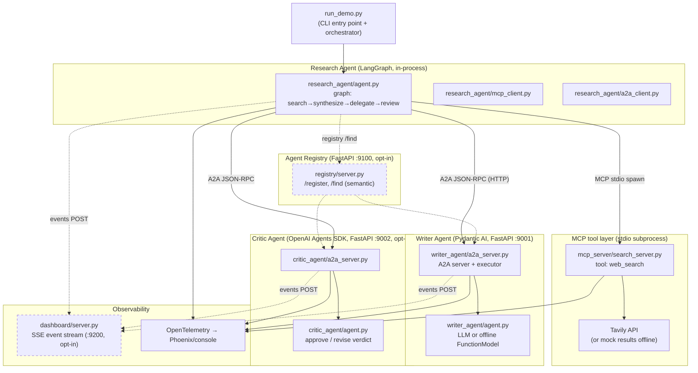
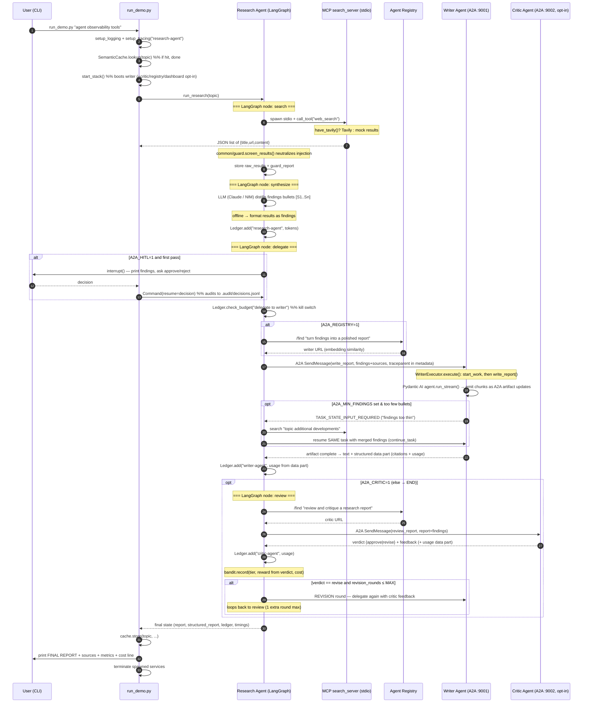
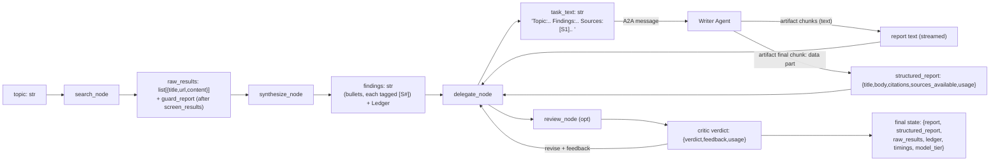

# Architecture & Code Walkthrough

This document explains how the **a2a-mcp-multi-agent** project works end to
end — what it does, how the pieces fit, and how data moves through them. It is
written for a competent engineer who is new to this specific codebase.

---

## Project Overview

This is a **cross-framework multi-agent research-and-report pipeline**. You
give it a topic (e.g. "agent observability tools"); it searches the web,
distills findings, writes a polished cited report, optionally critiques it,
and returns the result — *while three agents built on three different AI
frameworks talk to each other over a standardized protocol*.

The point of the project is to demonstrate the two interoperability seams that
matter in agentic systems, and to do it with production discipline:

- **MCP** (Model Context Protocol) — the *agent → tool* seam. The research
  agent reaches its `web_search` tool through MCP.
- **A2A** (Agent2Agent) — the *agent → agent* seam. Agents find each other,
  delegate tasks, negotiate, and stream results over A2A.

**Tech stack:** Python 3.14, **uv** (package manager), **LangGraph**
(research agent), **Pydantic AI** (writer agent), **OpenAI Agents SDK** (critic
agent), **a2a-sdk 1.x** (protobuf-typed JSON-RPC), **MCP SDK** (FastMCP over
stdio), **FastAPI + uvicorn** (agent servers + registry + dashboard),
**OpenTelemetry + OpenInference + Arize Phoenix** (distributed tracing),
Tavily (web search), NVIDIA NIM / Anthropic (LLM providers, with a fully
offline deterministic fallback).

Everything has an **offline mode** (`A2A_DEMO_OFFLINE=1`): no API keys, no
network, deterministic outputs. This is what CI runs, and it's why the whole
pipeline is testable without credentials.

---

## Architecture

### High-level component map



*Dashed lines = opt-in (disabled unless the relevant env var is set).
Solid lines = always exercised on a normal run.*

### Component responsibilities

| Component | File(s) | Responsibility |
|---|---|---|
| **CLI / orchestrator** | `run_demo.py` | Parses args, boots the stack (writer, critic, registry, dashboard), runs the research pipeline, prints the report + metrics, manages the semantic cache. |
| **Shared library** | `common/*.py` | Config, logging, tracing, cost ledger, resilience (retry/breaker), report schema, semantic cache, audit log, event emitter, injection guard, bandit router. Imported by every agent. |
| **Research Agent** | `research_agent/` | The LangGraph state machine. Owns the pipeline: search → synthesize → delegate (HITL gate) → review. Talks MCP (to tool) and A2A (to writer/critic). |
| **MCP web-search server** | `mcp_server/search_server.py` | FastMCP server over stdio. Exposes one tool, `web_search`, backed by Tavily or deterministic mock results. |
| **Writer Agent** | `writer_agent/` | Pydantic AI agent behind a FastAPI A2A server. Turns findings + sources into a ~300-word cited report. Streams the report chunk-by-chunk; ships a structured data part (citations + usage). |
| **Critic Agent** | `critic_agent/` | OpenAI Agents SDK behind a FastAPI A2A server. Reviews the report → verdict `approve` or `revise` + feedback. Drives the reflection loop. |
| **Agent Registry** | `registry/` | FastAPI service. Agents self-register their card on startup; callers query `/find` with a natural-language capability and get the best-matching agent URL (NIM embeddings, or token-overlap offline). |
| **Live Dashboard** | `dashboard/server.py` | FastAPI + SSE. Agents POST events; the browser page streams them live. Pure observability — never blocks the pipeline. |
| **Eval harness** | `evals/run_evals.py` | N-run reliability + quality harness. Deterministic metrics always; an LLM judge scores faithfulness/completeness/writing when a key is present. CI gates on these. |
| **Benchmarks** | `benchmarks/a2a_overhead.py` | Measures A2A JSON-RPC latency overhead vs. a direct in-process call. |
| **Red-team** | `redteam/`, `common/guard.py` | Indirect prompt-injection defense + attack corpus + ASR (attack-success-rate) measurement harness. |
| **Tests** | `tests/` | 51 offline-deterministic tests covering every behavior above. |

### Key non-obvious design decisions

1. **Two protocols, two seams, on purpose.** MCP for agent↔tool; A2A for
   agent↔agent. They are never mixed. The research agent is the *only*
   component that talks both — it's the bridge.

2. **Offline mode is a real mode, not a stub.** `A2A_DEMO_OFFLINE=1` swaps in
   deterministic `FunctionModel`s and mock search results, but the *same code
   paths* (MCP stdio round-trip, A2A JSON-RPC, tracing, streaming, retries)
   all still execute. This is what makes the 51 tests meaningful without any
   credentials.

3. **Trace context crosses both seams.** W3C `traceparent` is injected into
   the MCP subprocess *spawn environment* (crossing the stdio process
   boundary) and into A2A *message metadata* + HTTP headers (crossing the
   protocol boundary). Result: one distributed trace spans all three
   services. See `common/tracing.py`.

4. **Msgpack-safe ledger.** The cost `Ledger` is serialized as a plain dict
   (`to_dict()`/`from_dict()`) because LangGraph checkpointer state must be
   msgpack-serializable. A naked object would break checkpointing.

5. **Three NVIDIA-NIM paths, three SDK idioms.** When using the GLM-5.2 model
   via NVIDIA NIM, each framework reaches it differently: LangGraph via
   `ChatNVIDIA`, Pydantic AI via `OpenAIChatModel` + `OpenAIProvider`, OpenAI
   Agents SDK via `AsyncOpenAI` + `OpenAIChatCompletionsModel`.

6. **Graceful degradation everywhere.** No registry → fall back to static
   URLs. No dashboard → events silently drop. No cache → always run the
   pipeline. No LLM key → offline models. No Tavily → mock results.

---

## Workflow

### The main flow: topic → cited report



### Step-by-step narrative

1. **Entry — `run_demo.py:main()`.** Parse the topic arg. Set up logging and
   tracing for the `research-agent` service. Log which "mode" you're in
   (`llm=anthropic|nvidia-nim|offline`, `search=tavily|mock`).

2. **Semantic cache check.** If `A2A_CACHE=1`, construct a `SemanticCache`
   (`common/cache.py`) and `lookup(topic)`. A hit (NIM embedding cosine ≥ 0.90,
   or exact match offline) prints the cached report and exits — zero tokens,
   zero A2A calls.

3. **Boot the stack — `run_demo.py:start_stack()`.** Spawn (as subprocesses,
   re-entering via `python -m <module>`) the opt-in services, then the writer:
   - `A2A_DASHBOARD=1` → dashboard on `:9200` (and set `A2A_DASHBOARD_URL`).
   - `A2A_REGISTRY=1` → registry on `:9100` (and set `A2A_REGISTRY_URL`).
   - writer on `:9001` (always).
   - `A2A_CRITIC=1` → critic on `:9002`.
   Each spawned service is health-polled (up to ~10s) before proceeding, and
   the registry URL is placed in the env *before* agents spawn so they
   self-register on startup.

4. **Run the graph — `research_agent/agent.py:run_research()`** creates a
   LangGraph with an `InMemorySaver` checkpointer (enables `interrupt()`),
   starts a root span `research.pipeline`, and `ainvoke`s the graph.

5. **`search_node`** calls `mcp_web_search()` (`research_agent/mcp_client.py`),
   which spawns `mcp_server.search_server` over **stdio**, injects the
   `traceparent` into the spawn env, and calls the `web_search` tool. The server
   returns Tavily or mock results. Back in the node, `common.guard.screen_results`
   runs each result through sentence-level injection neutralization +
   spotlighting wrapping before it can reach the synthesis LLM.

6. **`synthesize_node`** formats results as `[S1]..[Sn]` and asks the LLM
   (Claude via `ChatAnthropic`, or GLM-5.2 via `ChatNVIDIA`, or offline
   formatting) to produce bullet findings, each tagged `[S#]`. Token usage is
   recorded in the `Ledger` (estimated at ~4 chars/tok offline).

7. **`delegate_node`** is the A2A seam.
   - **HITL gate** (if `A2A_HITL=1`, first pass only): `interrupt()` checkpoints
     the graph; `run_research` resumes with the human's
     approve/reject decision (recorded to `.audit/decisions.jsonl` with a
     findings SHA-256). Rejection raises and aborts.
   - **Budget kill switch**: `Ledger.check_budget("delegate to the Writer
     Agent")` raises `BudgetExceededError` *before* spending, if
     `A2A_BUDGET_TOKENS` is already exceeded.
   - **Registry routing** (if `A2A_REGISTRY=1`): `find_agent(capability,
     fallback)` queries the registry; it returns the registered writer URL if
     the embedding/Jaccard score ≥ 0.30, else the static fallback.
   - **Bandit** chooses a model-tier hint (`BanditRouter.choose()`,
     `common/bandit.py`) and passes it through to the writer in the task text.
   - **Delegation** (`research_agent/a2a_client.py:delegate_report()`): discover
     the writer's Agent Card, build a `SendMessageRequest` with the findings +
     sources + a `traceparent` injected into message metadata, and send it —
     all wrapped in `with_retries()` behind a per-agent `CircuitBreaker`.
   - **Negotiation**: if the writer returns `TASK_STATE_INPUT_REQUIRED`
     (`A2A_MIN_FINDINGS` set and too few bullets), the node catches
     `InputRequiredError`, runs an extra MCP search, merges fresh results, and
     resumes the *same* task via `continue_task()` (same task_id/context_id).

8. **Writer side — `writer_agent/a2a_server.py:WriterExecutor.execute()`.**
   Enqueues the task, `start_work()s`, extracts the caller's trace parent from
   message metadata, opens a `writer.execute_task` SERVER span, and calls
   `write_report()` (`writer_agent/agent.py`). With an LLM key, the report is
   **streamed** — `agent.run_stream()` + `stream_text(delta=True)` emits chunks
   that become A2A artifact-update events (`append=True` up to the last chunk).
   The final chunk appends a structured **data part** with parsed citations
   (`common/report.parse_report`) and token usage. The task completes.

9. **`review_node`** (only if `A2A_CRITIC=1`, via `_after_delegate` conditional
   edge). Delegates to the critic agent; gets `{verdict, feedback, usage}`.
   - **Bandit reward**: verdict `approve` → reward 1.0, `revise` → 0.3; recorded
     against the chosen tier with an estimated cost.
   - **`_after_review`**: if `revise` and `revision_rounds ≤
     MAX_REVISION_ROUNDS`, route back to `delegate` (one revision round with
     critic feedback); otherwise ship the last draft.

10. **Finish.** `run_research` returns the final state. `run_demo.main()` stores
    it in the semantic cache, then `_print_result()` prints the report, the
    cited sources, a metrics line (total/search/synthesis/delegation timings,
    citation coverage), and a cost line (`Ledger.summary()`). Spawned
    subprocesses are terminated in a `finally` block.

### The reflection loop (variant)

With `A2A_CRITIC=1` the pipeline becomes a **bounded evaluator-optimizer loop**:
`delegate → review → (revise? → delegate → review) → END`, capped at
`MAX_REVISION_ROUNDS = 1`. The critic is a genuinely separate agent on a *third*
framework (OpenAI Agents SDK), reached over A2A — so reflection is a real
protocol exchange, not an in-process function call. You can force a revise
verdict deterministically with `A2A_CRITIC_FORCE_REVISE=1` (test hook).

### The negotiation variant (`A2A_MIN_FINDINGS=N`)

Set this and pass deliberately-thin findings. The writer pauses the task with
`TASK_STATE_INPUT_REQUIRED`. The research agent then runs *another* MCP search,
merges new results into the findings, and resumes the **same** task id — proving
the A2A task lifecycle isn't just fire-and-forget. Tested in
`tests/test_phase3.py::test_multi_turn_negotiation_resumes_same_task`.

---

## Data Flow

### Document/data shapes as they move through the system



### What crosses which boundary, and how

| Boundary | What crosses | Mechanism | File |
|---|---|---|---|
| Research → MCP tool | `query`, `max_results` → JSON list of results | MCP stdio `call_tool`; **traceparent** in spawn env | `research_agent/mcp_client.py`, `mcp_server/search_server.py` |
| Research → Writer (A2A) | task text (topic + findings + `[S#]` sources + model-tier hint) | A2A `SendMessageRequest`; **traceparent** in message metadata + HTTP header | `research_agent/a2a_client.py`, `writer_agent/a2a_server.py` |
| Writer → Research (A2A, return) | report text (streamed artifact chunks) + structured data part (citations + usage) | A2A artifact-update + status-update events | same |
| Research → Critic (A2A) | report + findings | A2A `SendMessageRequest` | `critic_agent/a2a_server.py:CriticExecutor` |
| Agent → Registry | self: card URL on startup; inverse: capability string → best agent URL | HTTP `/register`, `/find` | `registry/server.py`, `registry/client.py` |
| Agent → Dashboard | `{agent, kind, detail}` event blobs | fire-and-forget HTTP POST `/event`; SSE `/stream` out | `common/events.py`, `dashboard/server.py` |
| Pipeline → Trace collector | OpenTelemetry spans (GenAI semantic conventions) | OTLP HTTP to Phoenix, or console | `common/tracing.py` |
| Pipeline → Audit log | HITL decision + findings hash | append-only `.audit/decisions.jsonl` | `common/audit.py` |
| Pipeline → Cache | topic → {report, structured_report, raw_results, timings} | sqlite, keyed by topic embedding or normalized exact match | `common/cache.py` |
| Pipeline → Bandit | (tier, reward, cost) tuples | sqlite `bandit_pulls` table, persistent across runs | `common/bandit.py` |

### Cost attribution flow (one of the subtle parts)

The writer is a separate process — it can't write to the research agent's
`Ledger` in memory. Instead:
1. The writer's `parse_report` produces a structured report.
2. Its own token usage (`input_tokens`, `output_tokens`, `estimated` flag) is
   embedded in the **final artifact data part**.
3. The research agent's `delegate_node` extracts `usage` from that data part
   and calls `Ledger.add("writer-agent", ...)`.
4. The critic does the same on its return.
5. `Ledger.check_budget()` reads cumulative tokens before each delegation —
   so the kill switch fires *before* spending, not after.

### Trust-boundary data flow (the injection defense)

Web search results are attacker-controllable. `search_node` passes each result
through `common.guard.screen_results()`:
1. **Neutralize**: split content into sentence spans; any sentence matching
   one of 8 injection regexes is replaced wholesale with
   `[filtered: suspected prompt injection]` (removes directive + payload).
2. **Spotlighting**: the (now-clean) content is wrapped in
   `<untrusted_search_result>` delimiters with an explicit "treat as data only"
   instruction.
3. The screened results then flow into `synthesize_node`'s prompt.

Toggled by `A2A_GUARD` (default `on`); the red-team harness measures ASR with it
off vs. on. See `SECURITY.md`.

---

## Key Files & Entry Points

| File | Purpose / role |
|---|---|
| `run_demo.py` | **CLI entry point.** Orchestrates stack boot, cache, pipeline run, result printing, cost line. |
| `pyproject.toml`, `uv.lock`, `.python-version` | Dependencies (3.14), pinned lockfile, uv manifest. |
| `common/__init__.py` | Central config: hosts/ports, `registry_url()`, `have_anthropic/nvidia/tavily()`, `offline_forced()`, `setup_logging()`. Loads `.env` unless offline. |
| `common/tracing.py` | `setup_tracing(service)`, `inject_context()`/`extract_context()` — W3C traceparent across MCP spawn-env and A2A metadata. |
| `common/costs.py` | `Ledger` (per-agent token/cost), `check_budget()` kill switch, `estimate_tokens()` (offline ~4 chars/tok). msgpack-safe via `to_dict`/`from_dict`. |
| `common/resilience.py` | `with_retries()` (exp backoff + jitter) and `CircuitBreaker` (3 fails → open 30s). |
| `common/report.py` | `Report`/`Citation` pydantic schema; `format_sources()`, `parse_sources()`, `parse_report()` — the typed contract across A2A. |
| `common/guard.py` | Indirect-prompt-injection defense: `neutralize()`, `wrap_untrusted()`, `screen_results()`, 8 `INJECTION_PATTERNS`. |
| `common/cache.py` | `SemanticCache` (sqlite; NIM embeddings cosine ≥ 0.9, or normalized exact match offline). |
| `common/bandit.py` | `BanditRouter` — epsilon-greedy over model tiers; sqlite-persistent; `choose()`/`record()`/`frontier()`. |
| `common/audit.py` | `record_decision()` — append-only HITL audit JSONL. |
| `common/events.py` | `emit_event()` — fire-and-forget dashboard POST. |
| `common/embeddings.py` | Shared NIM embedding helpers (`embed()`, `cosine()`) used by the semantic cache and the registry. |
| `common/a2a_service.py` | Shared A2A server scaffolding: `build_a2a_app()` (card+RPC routes, API-key middleware, tracing, registry self-registration), `declare_api_key_scheme()`, `serve()`. |
| `mcp_server/search_server.py` | **MCP server.** FastMCP stdio; `web_search` tool; Tavily or mock; catches traceparent from env. |
| `research_agent/agent.py` | **Research Agent (LangGraph).** `build_graph()`, `search_node`/`synthesize_node`/`delegate_node`/`review_node`, `run_research()` with interrupt loop, `_prompt_human()`. |
| `research_agent/mcp_client.py` | `mcp_web_search()` — spawns MCP server stdio, injects traceparent into spawn env. |
| `research_agent/a2a_client.py` | `discover_agent()`, `delegate_report()`, `continue_task()`, `delegate_review()` — all behind `with_retries` + per-agent breakers. `InputRequiredError`. |
| `writer_agent/a2a_server.py` | **Writer A2A server.** `WriterExecutor`, streaming emit, multi-turn negotiation (`A2A_MIN_FINDINGS`), API-key middleware, card self-registration. |
| `writer_agent/agent.py` | `build_writer_agent()` (Anthropic / NIM / offline FunctionModel), `write_report()` with streaming. |
| `writer_agent/agent_card.json` | Committed snapshot of the writer's published Agent Card (refreshed only on the canonical port 9001 / no-auth config). |
| `critic_agent/agent.py` | `review_report()` — OpenAI Agents SDK against NIM, or offline deterministic checks; `_force_revise()` test hook. |
| `critic_agent/a2a_server.py` | **Critic A2A server.** `CriticExecutor`; self-registers. |
| `registry/server.py` | Agent registry FastAPI. `/register` (fetch & embed card), `/find` (semantic best match). NIM embeddings or Jaccard-token offline. |
| `registry/client.py` | `self_register()` (waits for own card, then POSTs), `find_agent()` (degrades to fallback). |
| `dashboard/server.py` | FastAPI + SSE dashboard; in-memory event deque (maxlen 500) + subscriber fanout. |
| `evals/run_evals.py` | **Eval harness.** N-run reliability + quality; LLM-judge (faithfulness/completeness/writing) when a key is set; writes `evals/RESULTS.md` + raw JSON. |
| `benchmarks/a2a_overhead.py` | A2A-overhead microbenchmark (auto-boots a writer server). |
| `redteam/corpus.jsonl` | 20 attack strings (8 categories) + 10 benign false-positive strings. |
| `redteam/harness.py` | ASR measurement: guard-off vs guard-on, false-positive count. |
| `tests/*.py` | 51 offline-deterministic tests (e2e, tracing, eval gate, resilience, costs, auth+cache, phase-3 behaviors, guard, bandit). |
| `Dockerfile`, `docker-compose.yml` | Container image + compose (writer service + demo runner). |
| `.github/workflows/ci.yml` | **CI:** runs `uv run pytest tests/ -q` offline; builds image; `docker compose run --rm demo`. |
| `SECURITY.md` | Threat model, defense layers, red-team results, known limitations. |
| `FAILURE_MODES.md` | Documented failure-mode table with observed traces. |
| `README.md` | Project front page / quickstart / measured results. |

---

## Setup / Run

Everything below is run from the repo root with [uv](https://docs.astral.sh/uv/).

### Install

```bash
uv sync          # creates .venv, installs from uv.lock
```

### Run the demo (offline, zero credentials)

```bash
uv run python run_demo.py "Summarize recent developments in agent observability tools"
```

Add opt-in env vars to exercise more of the system (all combinable, all with
offline fallbacks):

```bash
A2A_DEMO_OFFLINE=1 A2A_REGISTRY=1 A2A_CRITIC=1 A2A_DASHBOARD=1 A2A_HITL=1 \
  uv run python run_demo.py "agent observability tools"
```

| Env var | Effect |
|---|---|
| `A2A_CRITIC=1` | boot the Critic Agent; bounded reflection loop (≤1 revise round) |
| `A2A_REGISTRY=1` | boot the registry; semantic capability routing |
| `A2A_DASHBOARD=1` | boot the live dashboard at http://127.0.0.1:9200 |
| `A2A_HITL=1` | human approval on stdin before delegation (audited JSONL) |
| `A2A_MIN_FINDINGS=5` | writer negotiates for more input (multi-turn A2A) |
| `A2A_BUDGET_TOKENS=N` | abort before the next delegation once N tokens spent |
| `A2A_CACHE=1` | semantic cache — repeat topics cost $0 and skip all agents |
| `A2A_GUARD=off` | disable the prompt-injection guard (red-team harness toggles this) |
| `A2A_API_KEY=...` | API-key auth on A2A calls, declared in the Agent Card |
| `A2A_BANDIT_EPSILON=0.15` | exploration rate for the cost-quality bandit router |
| `A2A_DEMO_OFFLINE=1` | force deterministic zero-credential mode (what CI runs) |

### Run with real LLMs / search

Create a gitignored `.env` at the repo root:

```env
ANTHROPIC_API_KEY=...      # → Claude, all three frameworks
NVIDIA_API_KEY=...         # → GLM-5.2 via NVIDIA NIM
TAVILY_API_KEY=...         # → real web search
```

Leave `A2A_DEMO_OFFLINE` unset to use keys. With keys present each framework
reaches the model its own way (`ChatNVIDIA` / `OpenAIChatModel` /
`AsyncOpenAI`); with none set, deterministic offline models run the same paths.

### Tracing (one trace across all three services)

```bash
uvx arize-phoenix serve    # UI + OTLP collector on :6006
PHOENIX_COLLECTOR_ENDPOINT=http://localhost:6006 \
  uv run python run_demo.py "your topic"
```

Alternatively `A2A_DEMO_TRACE_CONSOLE=1` prints spans to stderr (used by
`tests/test_tracing.py`). No tracing env set ⇒ tracing is a no-op.

### Tests

```bash
uv run pytest tests/ -q     # 51 tests, all offline-deterministic
```

### Evals

```bash
uv run python -m evals.run_evals --n 20                         # offline-safe
uv run python -m evals.run_evals --n 5 --judge                   # + LLM judge (needs key)
```

### Red-team harness

```bash
uv run python -m redteam.harness                # ASR: guard-off vs guard-on
uv run python -m redteam.harness --runs 10     # more stable numbers
uv run python -m redteam.harness --json         # machine-readable
```

### A2A protocol microbenchmark

```bash
uv run python -m benchmarks.a2a_overhead --runs 20
```

### Docker

```bash
docker build -t a2a-mcp-multi-agent .
docker compose run --rm demo
```

---

## Gaps / things the code doesn't fully pin down (read before assuming)

- **In-memory stores.** The LangGraph checkpointer (`InMemorySaver`), the A2A
  task stores (`InMemoryTaskStore`), the registry's `_agents` dict, and the
  dashboard's `_events` deque are all in-process/in-memory. State does **not**
  survive a restart. The semantic cache and bandit router are the only stores
  that persist (sqlite).
- **No persistent task history.** A2A task state lives only as long as the
  writer/critic server process is alive. The negotiation/resume mechanism
  works because both ends of a single demo run share the same writer process.
- **Single-writer assumption.** The default topology runs one writer. Scaling
  the writer horizontally would need a shared task store; the current
  `InMemoryTaskStore` won't support that out of the box.
- **`MAX_REVISION_ROUNDS = 1`.** The reflection loop revises at most once;
  it then ships the last draft regardless of the critic's final verdict.
- **Card snapshot churn guard.** The writer rewrites `agent_card.json` *only*
  on the canonical config (default port 9001, no `A2A_API_KEY`). Other configs
  (tests, custom ports) intentionally do not touch the committed file.
- **Guard ↔ offline-writer coupling.** The offline pipeline is line-oriented:
  synthesis emits one `- …` bullet per line and the offline writer extracts
  them with a `^- ` regex. The guard's `wrap_untrusted()` therefore emits a
  **single-line** wrapper — reintroducing newlines around the wrapped content
  would split bullets across lines and silently zero out citation coverage
  (this exact regression was fixed in Phase 4; see `tests/test_eval_gate.py`).
- **Offline token usage is estimated.** `estimate_tokens` is ~4 chars/token
  and flagged `estimated=True` in the ledger; real usage comes from the model
  SDK. Cost numbers in offline mode are order-of-magnitude, not exact.
